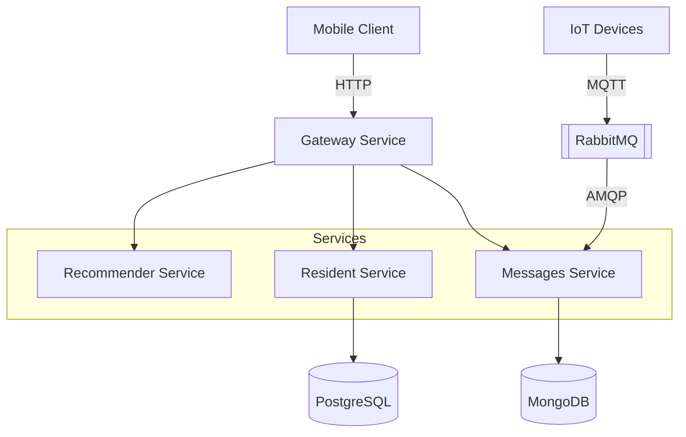

# Integrated Smart Home Scene Recommender (ISHSREC)

The Intelligent Smart Home Scene Recommender **(ISHSREC)** is a proof of concept developed as part of my master’s thesis research. This repository contains a microservices-based application designed to simulate smart home device communication and interaction while integrating the recommendation model proposed in my work.

## Context

The Internet of Things has transformed daily life by integrating smart devices into everyday routines and enabling intelligent environments. Smart Homes leverage these technologies to anticipate and address occupants’ needs, thereby enhancing comfort. However, the growing number of devices in modern residences often demands extensive manual configuration, contradicting the very goal of automation these environments aim to achieve. This work proposes a context-aware recommender system that, based on contextual information and user interaction history, provides automation scene suggestions, defined as collective device actions executed under specific contextual conditions. The approach aims to model user preferences and predict device configurations that align with situational contexts, thereby improving comfort, efficiency, and autonomy. To achieve this, we investigate non-sequential and sequential learning strategies, as well as frequent pattern mining, and evaluate their ability to predict and recommend appropriate automation actions. Performance is assessed using Macro and Micro F1 scores, as well as ranking-based metrics (MAP@5, MRR@5, and NDCG@5), complemented by a user-centered MOS evaluation.

## Table of contents

- [Architecture overview](#architecture-overview)
- [Services](#services)
- [Tech stack](#tech-stack)
- [Repository layout](#repository-layout)
- [Prerequisites](#prerequisites)
- [Quick start](#quick-start)
- [API reference](#api-reference)
- [Messaging (RabbitMQ)](#messaging-rabbitmq)
- [CI](#ci)
- [notes](#notes)

## Architecture overview

**ISHSREC** is a microservices-based platform for smart-home residents: account management, device telemetry, scene scheduling, and ML-driven recommendations. Services communicate over **REST** for synchronous calls and **RabbitMQ** for asynchronous device events.

Clients typically talk to **gateway-service**, which orchestrates calls to **resident-service** and **messages-service**. **recommender-service** pulls device history from messages-service, trains a model, and exposes recommendations. Device telemetry enters the system through RabbitMQ (MQTT-enabled broker) and is persisted by **messages-service** in MongoDB.



## Services

| Service | Stack | Port (host) | Database | Role |
|---------|-------|-------------|----------|------|
| **gateway-service** | Java 17, Spring Boot 3 | 8085 | — | API gateway: login aggregates JWT + device list |
| **resident-service** | Java 17, Spring Boot 3 | 8081 | PostgreSQL | Residents, auth (JWT), scenes; publishes `resident.created` |
| **resident-db** | PostgreSQL 16 | 5432 | — | `residentdb` for resident-service |
| **recommender-service** | Python 3, Flask | 5001 | — | Fetches device data from messages-service; serves recommendations |
| **messages-service** | Python 3, Flask | 5002 | MongoDB | Device registry, message history; consumes `home.devices` from RabbitMQ |
| **messages-mongo** | MongoDB 7 | 27017 | — | `messagesdb` for messages-service |
| **rabbitmq** | Custom image | 5672 / 1883 / 15672 | — | AMQP + MQTT broker; management UI on 15672 |

## Tech stack

- **Java**: Spring Boot 3.2, Spring Data JPA, Spring AMQP, Spring Actuator
- **Python**: Flask, Pydantic, pika, pandas, gunicorn
- **Data**: PostgreSQL 16, MongoDB 7
- **Messaging**: RabbitMQ 3 (AMQP + MQTT plugin in custom image)
- **Orchestration**: Docker Compose v2
- **CI**: GitHub Actions

## Repository layout

```
ISHSREC/
├── docker-compose.yml              # Default local stack
├── .env.example                    # Environment template
├── gateway-service/                # API gateway (Spring Boot)
├── resident-service/               # Residents, auth, scenes (Spring Boot + PostgreSQL)
├── recommender-service/            # Recommendations (Flask)
├── messages-service/               # Devices & telemetry (Flask + MongoDB)
└── .github/workflows/ci.yml        # Continuous integration
```

## Prerequisites

- [Docker Desktop](https://www.docker.com/products/docker-desktop/) with Docker Compose v2
- For local (non-Docker) development:
  - **JDK 17+** and **Maven 3.9+** (Java services)
  - **Python 3.11+** and **pip** (Python services)
  - Running instances of PostgreSQL, MongoDB, and RabbitMQ

## Quick start

1. **Copy environment defaults** (optional; Compose has built-in fallbacks):

   ```bash
   cp .env.example .env
   ```

2. **Start the stack**:

   ```bash
   docker compose up --build
   ```

## API reference

Base URLs below assume default Compose host ports.

### gateway-service (`http://localhost:8085`)

| Method | Path | Description |
|--------|------|-------------|
| `POST` | `/api/login` | Authenticate via resident-service; returns JWT, resident profile, and device list from messages-service |

---

### resident-service (`http://localhost:8081`)

| Method | Path | Description |
|--------|------|-------------|
| `POST` | `/auth/login` | Login; returns JWT and resident |
| `POST` | `/residents` | Create resident|
| `GET` | `/residents/{id}` | Get resident by ID |
| `POST` | `/scenes` | Create automation scene |
| `PUT` | `/scenes/{id}` | Update scene |
| `GET` | `/scenes/{id}` | Get scene by ID |

---

### messages-service (`http://localhost:5002`)

| Method | Path | Description |
|--------|------|-------------|
| `GET` | `/api/devices/` | List registered devices |
| `GET` | `/api/dev_messages/` | Query device message history |

---

### recommender-service (`http://localhost:5001`)

| Method | Path | Description |
|--------|------|-------------|
| `GET` | `/api/recommendations?limit=10` | Generate recommendations from the last two weeks of device data |

The service calls messages-service internally, updates an in-memory/pandas model, and returns a `recommendations` array. Training data snapshots may be cached as CSV files inside the container.

## CI

On every push or pull request to main, the workflow defined in .github/workflows/ci.yml is executed via GitHub Actions.

## Notes

This repository targets **local development**.